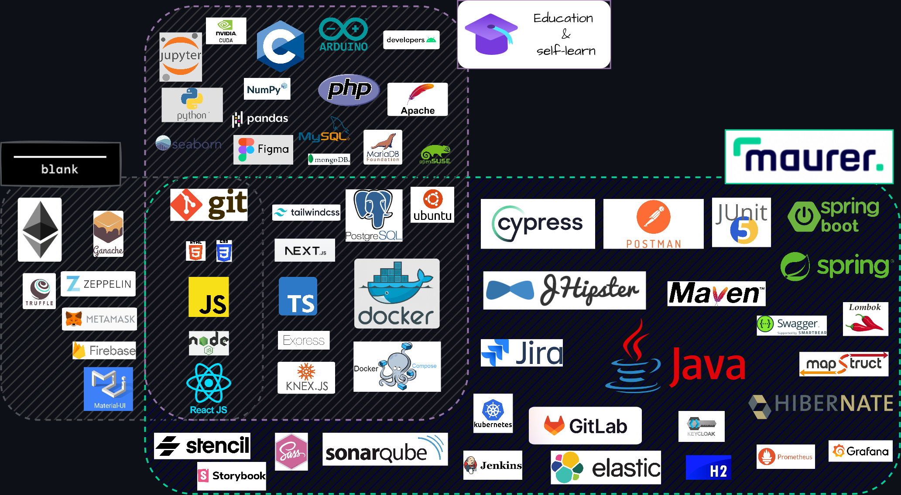

### Hi there 👋

- 🔭 I'm an Computer Science student at [FESB](https://www.fesb.unist.hr/) 🇭🇷.
- 🌱 I'm also a passionate web developer interested in software architecture, security, and big data.

- ⚡ Here are some of technologies, languages, CASE tools, ..., I used through all these years:
  - (🤔 I don’t claim to be an expert at all of them, but I used them in some period of my career and this is the stack I am familiar with.)

---

- 📫 How to reach me -> [LinkedIn](https://www.linkedin.com/in/netz00/)

- ⚡ Some of my publications
  - [Medium articles](https://medium.com/@Netz00)
  - [JHipster Development Platform](https://www.linkedin.com/feed/update/urn:li:activity:7009201829204889601?utm_source=share&utm_medium=member_desktop)

<!--
**Netz00/Netz00** is a ✨ _special_ ✨ repository because its `README.md` (this file) appears on your GitHub profile.

Here are some ideas to get you started:

- 🔭 I’m currently working on ...
- 🌱 I’m currently learning ...
- 👯 I’m looking to collaborate on ...
- 🤔 I’m looking for help with ...
- 💬 Ask me about ...

- 😄 Pronouns: ...
- ⚡ Fun fact: ...
-->
