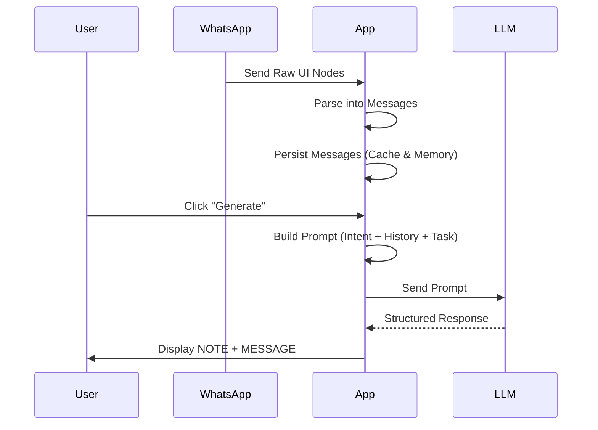

# Whispr – AI Messaging Assistant

  

  
  
  

Whispr is an Android application that simplifies the use of LLMs for messaging by removing the need to manually copy chat content into external tools. It automatically collects chat history and combines it with a user-defined intent, then sends this structured prompt to an LLM to generate suggested replies.

Chats contain more than just messages, including timing, length, writing style, and shifts in tone over time. Whispr preserves and forwards this full context, allowing the LLM to generate responses that reflect the priorities, mood, and communication style of each conversation. This results in more natural, relevant, and timely replies.

A core feature is the **intent system**, where users define how responses should be generated in terms of tone, style, and goal. Intent is defined at the chat level, and users can create new intent templates or modify existing ones to fit different communication contexts. This provides precise control over how replies are crafted.

Built with a minimal architecture in Java, Whispr acts as a lightweight client that delegates all reasoning to an external LLM via OpenRouter. The app itself performs no analysis or decision-making, keeping the system simple, transparent, and easy to extend.

## How It Works

Whispr gathers conversation history and combines it with the selected chat-level intent. This structured prompt is sent to the LLM, which performs all reasoning, interprets the context, and generates a suggested response based on the defined tone, style, and goal. The app then presents the output to the user for review and sending.

## Use Cases

Whether you are negotiating with clients, coordinating with vendors, or engaging with followers, Whispr helps you manage conversations efficiently, stay consistent, and respond with clarity and confidence.

## Installation Instructions

1. Join the Early Access program: https://groups.google.com/g/whispr-early-access
2. Sign in with the same Google account used for the Play Store
3. Install Whispr from the Play Store: https://play.google.com/store/apps/details?id=com.netz00.whispr
4. Open the app and grant the required permissions to start using it

Alternatively, download the APK and install it manually:  
[Download APK](whispr_0.1.10.apk)

> Note: You may need to enable "Install unknown apps" in your device settings before installing the APK.
